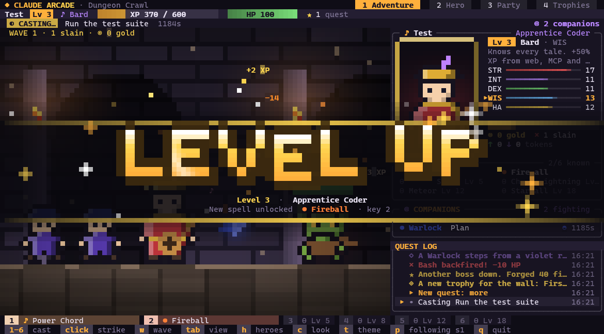
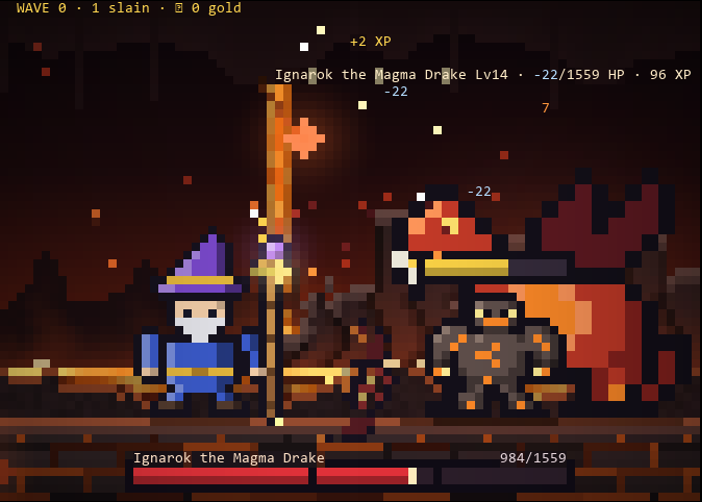
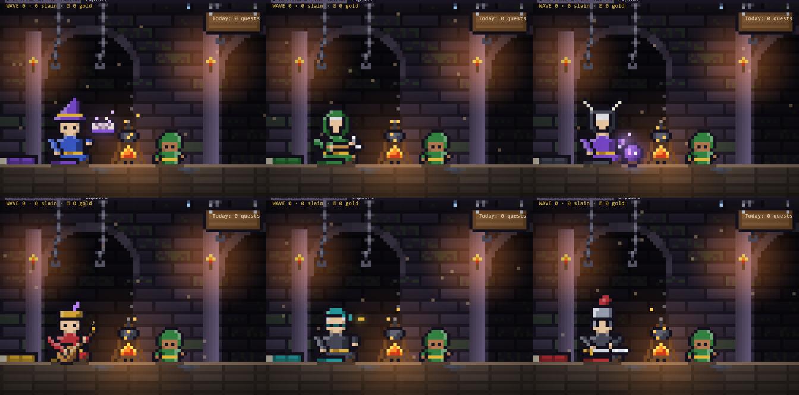
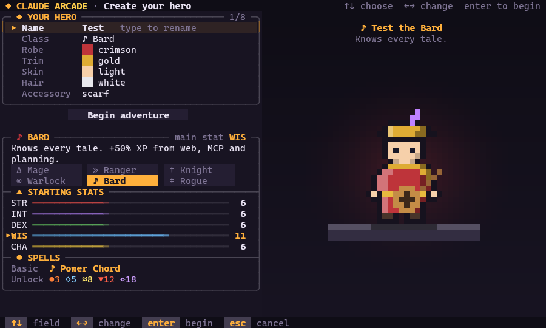
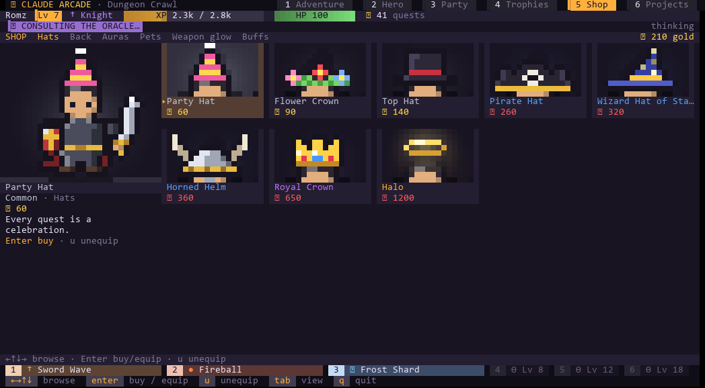
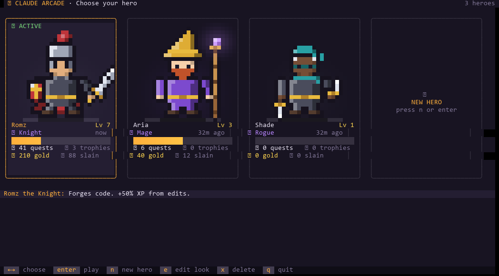
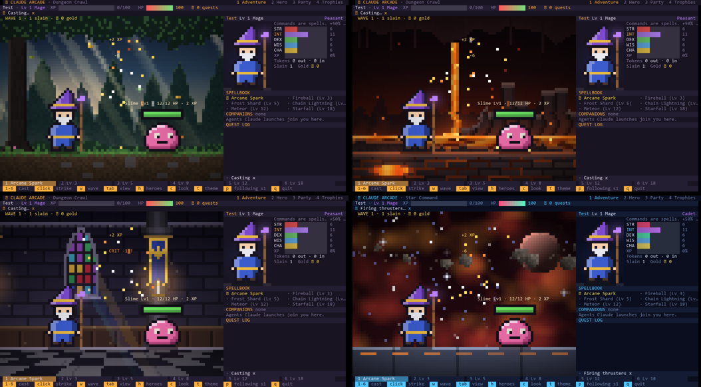

# Claude Arcade

**A fun side quest while you work.** Claude Arcade is an open-source Claude Code plugin that turns
your terminal into a retro RPG. The first time you open it you create a hero. From then on, every
prompt you send is a quest, every failing command is a monster, and every agent Claude launches
joins your party. Your hero levels up from your real Claude usage: tools, finished tasks and
tokens.

It's Zork, 80s 8-bit games and the virtual pet you had to keep alive, rolled into one and living
next to Claude in your terminal. Play along while you wait, or just glance over and watch your
hero fight.

- **All in the CLI.** Pixel art drawn with half-block characters in 24-bit color. No browser, no
  window, no account.
- **Built for developers.** XP comes only from real work, so your level actually means something.
- **Open source, zero dependencies.** Plain Node 18+, MIT licensed.
- **Local and private.** Everything stays in `~/.claude/arcade/`. Nothing is sent anywhere.

## Screenshots



| Boss fights on long tasks | Your hero camps between tasks |
|---|---|
|  |  |

| Create your hero | Spend gold in the Shop |
|---|---|
|  |  |

| Hero roster | The world changes as you level |
|---|---|
|  |  |

## 🌐 Play in your browser

```
arcade web
```

Opens the same live game in your browser with full graphics (GPU lighting, bloom, 60 fps). It runs
only on your computer. See [Web View](https://github.com/Superromz/claude-arcade/blob/main/docs/wiki/Web-View.md).

## Features at a glance

- **Your hero.** Six classes (Mage, Ranger, Knight, Warlock, Bard, Rogue), each with a main stat,
  an XP bonus and its own attack animations. Pick colors, skin, hair and an accessory in the
  character creator. Keep several heroes, each with their own progress.
- **Battles that follow Claude.** When Claude starts a task, waves of monsters attack. Every tool
  call casts a matching spell. Long tasks bring a boss with phases.
- **Spellbook.** Fireball, Frost Shard, Chain Lightning, Meteor and Starfall unlock as you level.
  Cast them yourself from the hotbar, or click monsters to strike them.
- **Companions.** Agents that Claude launches join the fight as hero classes, each with a battle
  role.
- **A camp between tasks.** When Claude is idle your hero sits by the fire doing a class activity,
  then falls asleep. A board shows today's quests. While Claude works, a thought bubble shows what
  your hero is up to.
- **Real progression.** XP from tools, finished tasks, monsters slain during real tasks, and your
  actual token usage. LEVEL UP banners, 13 achievements, a daily streak, and stats per project.
- **A Shop.** Spend gold on hats, capes, auras, pets and weapon glows, or on battle buffs. Never on
  XP.
- **An animated status line.** A two-row HUD under Claude's prompt shows what your hero is doing,
  your level, XP, HP, combo, "mana" (context left) and what the session has cost.
- **Approve Claude from the game.** Permission requests can pop up in the game pane as an
  encounter. Press Y or N and keep playing.
- **Three themes.** Dungeon Crawl (rpg), Star Command (space) and 8-Bit Arcade (retro, ASCII-safe).

## Install

You need Claude Code and Node.js 18 or newer. In Claude Code, run:

```
/plugin marketplace add superromz/claude-arcade
/plugin install claude-arcade@claude-arcade
/claude-arcade:setup
```

`setup` takes an optional theme: `/claude-arcade:setup space` or `/claude-arcade:setup retro`. The
plugin installs at user scope, so it works in every project.

Setup adds the status line and themed spinner to `~/.claude/settings.json` and backs up whatever was
there before. `/claude-arcade:uninstall` puts your old settings back. See
[Getting Started](docs/wiki/Getting-Started.md) for details and local installs.

## Quick start

1. Split your terminal so the game sits next to Claude. In Warp press `Ctrl+Shift+D`
   (`Cmd+D` on macOS). In Windows Terminal, `/claude-arcade:play` opens the split for you.
2. In the new pane, run:

   ```sh
   arcade
   ```

3. Create your hero, then go back to Claude and give it a task. The monsters arrive when Claude
   starts working.

Not sure how to split your terminal? Run `/claude-arcade:play` and it will tell you (and copy the
command to your clipboard).

## Controls

| Key | Game pane |
|---|---|
| `1`-`6` | Cast a spell from the hotbar (1.5× damage, with cooldowns) |
| `space` | Basic attack |
| Mouse click | Strike a monster, cast from the hotbar, or switch tabs |
| `w` | Summon a practice wave (gold only, no XP) |
| `tab` / `←` `→` | Switch tab: Adventure, Hero, Party, Trophies, Shop, Projects (or click a tab) |
| `h` | Hero roster (switch, create or delete heroes) |
| `c` | Change your hero's look |
| `t` | Next theme |
| `p` | Follow a different Claude session |
| `q` / `Esc` | Quit |

In the Shop, the arrow keys browse, `Enter` buys or equips, and `u` unequips. When a permission
request shows up: `Y` allows it once, `N` denies it, `C` sends it back to Claude's normal dialog. The full list is on [Commands and Controls](docs/wiki/Commands-and-Controls.md).

## Privacy

Claude Arcade runs entirely on your machine. It reads Claude Code's hook events and your local
transcripts (only to count tokens), and it writes to `~/.claude/arcade/`. It makes no network
requests. See [Privacy and Data](docs/wiki/Privacy-and-Data.md).

## Documentation

The wiki explains how everything works:

- [Home](docs/wiki/Home.md) and [Getting Started](docs/wiki/Getting-Started.md)
- [Heroes and Classes](docs/wiki/Heroes-and-Classes.md), [Hero Roster](docs/wiki/Hero-Roster.md)
- [Combat and Spells](docs/wiki/Combat-and-Spells.md), [Companions](docs/wiki/Companions.md)
- [Progression and XP](docs/wiki/Progression-and-XP.md), [Project Stats](docs/wiki/Project-Stats.md)
- [Biomes and Themes](docs/wiki/Biomes-and-Themes.md), [Status Line and Toasts](docs/wiki/Status-Line-and-Toasts.md)
- [In-Game Approvals](docs/wiki/In-Game-Approvals.md), [Commands and Controls](docs/wiki/Commands-and-Controls.md)
- [Shop](docs/wiki/Shop.md), [Camp and Celebrations](docs/wiki/Camp-and-Celebrations.md), [Roadmap](docs/wiki/Roadmap.md), [FAQ](docs/wiki/FAQ.md)
- For contributors: [Architecture](docs/wiki/Architecture.md) and [Contributing](CONTRIBUTING.md)

## What's next

Class skill kits, a skill tree with paragon levels, recruitable companions, an HD mode, and a
global leaderboard where you can compare your hero with everyone else's (and fight them in async
PvP). See the [Roadmap](ROADMAP.md) and the [Changelog](CHANGELOG.md).

## Contributing

Contributions are welcome: new monsters, themes, spells, fixes and docs. The game is plain Node
with no dependencies, so `npm test` is all you need to get going. Please read
[CONTRIBUTING.md](CONTRIBUTING.md) first. Two rules matter most: update the docs in the same change,
and XP only ever comes from real Claude usage.

## License

[MIT](LICENSE)
